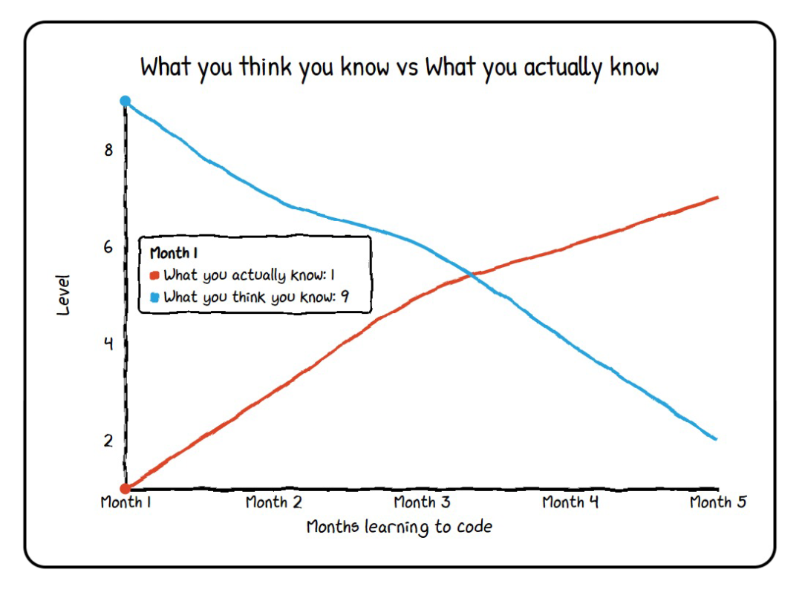
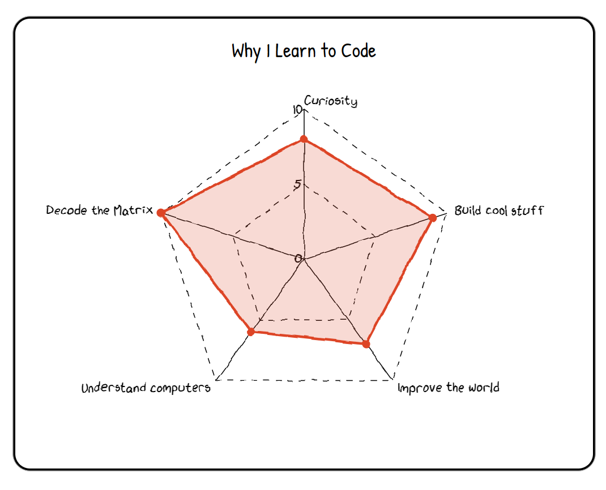

# 👋 Hi, I'm Reşat Kavcı!

 
  

### 🚀 About Me

I'm a passionate **Test Automation Engineer** with a strong background in automating web, API, and mobile tests using the latest tools and technologies.  
My expertise lies in creating efficient and scalable test frameworks using various programming languages and methodologies.

- 💻 **Languages** : Java, Python, Ruby  
- 🛠️ **Tools** : Selenium, Cucumber, JUnit, TestNG, Maven, Karate, Capybara, Playwright, Cypress  
- 🏗️ **Frameworks & Methodologies** : POM (Page Object Model), BDD (Behavior-Driven Development)  
- 🔗 **Integration Tools** : Azure DevOps, Jenkins, Docker, Swagger, Postman  
- 📊 **API Testing** : RESTful services with Postman and Swagger, SOAP testing with SOAP UI  

<!-- Stats generales -->

  

<!-- Diagramas "Escritos a mano" -->

  <table>
    <tr>
      <td align="center" style="border: 2px solid #00ff00; border-radius: 10px; padding: 5px;">
        
      </td>
      <td align="center" style="border: 2px solid #00ff00; border-radius: 10px; padding: 5px;">
        
      </td>
    </tr>
  </table>

<!-- Grafico de actividad GitHub -->

<!-- Contribuciones 3D GitHub -->

### 🛠️ Tech I Use

   
  
  
  
  
  
  
  
  
  

### 💻 Tools I Use

  
  
  
  
  
  
  
  
  
  

### 📈 Professional Experience

- Specialized in building robust test automation solutions for web and API testing.  
- Designed and implemented BDD frameworks from scratch using Cucumber and Selenium.  
- Skilled in cross-browser and cross-platform testing strategies.  
- Developed data-driven and keyword-driven frameworks to enhance script maintainability.  
- Expert in XPath/CSS selectors for dynamic elements.  
- Automated RESTful & SOAP APIs using Postman, Swagger, SOAP UI.  
- Integrated test automation into CI/CD pipelines (Jenkins, Azure DevOps, GitHub Actions).  
- Mentored junior testers, contributing to team knowledge sharing.  
- Practiced Agile methodologies and actively participated in Scrum ceremonies.

### 📬 Let's Connect!

If you'd like to chat about testing, tech, or collaborate:

