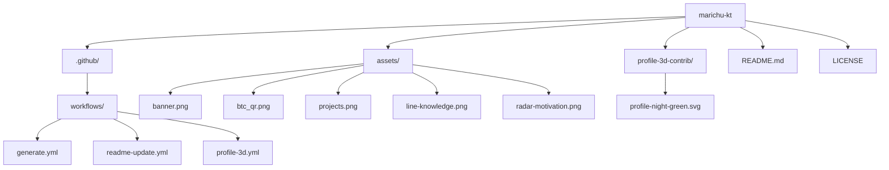
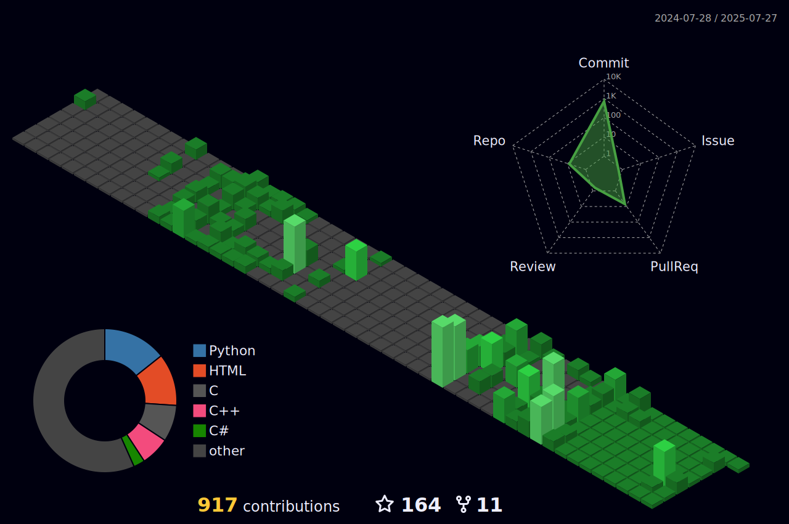

<!-- Última actualización: 2025-07-28 01:47:14 UTC -->

<!-- Header SVG -->

###

<!-- Mensaje bienvenida -->
<h1 align="center">
  
</h1>

###

<!-- Banner -->

###

<!-- Stats generales -->

  

###

<!-- Lenguajes, Herramientas y Plataformas -->

  <a href="https://skillicons.dev">
    <!-- Fila 1 -->
    
     
    <!-- Fila 2 -->
    
     
    <!-- Fila 3 -->
    
     
    <!-- Fila 4 -->
    
  </a>

>[!NOTE]
> 📝 Above this note, I've listed all the programming languages and technologies I've used in my life so far.

###

<!-- Proyectos / Repositorios -->

  

>[!TIP]
> 🌟 **Support matters!** If you find any of these projects useful or interesting, please consider giving them a **star ⭐**. Every bit of encouragement helps me keep building awesome things 🚀. Thanks for your support! 🙌

<table>
  <tr>
    <td>
      
    </td>
    <td>
      
    </td>
  </tr>
  <tr>
    <td>
      
    </td>
    <td>
      
    </td>
  </tr>
  <tr>
    <td>
      
    </td>
    <td>
      
    </td>
  </tr>
  <tr>
    <td>
      
    </td>
    <td>
      
    </td>
  </tr>
  <tr>
    <td>
      
    </td>
    <td>
      
    </td>
  </tr>
    <tr>
    <td colspan="2" align="center" valign="middle">
      <strong style="color:#b0e0e6; font-size: 20px;">🚧 Coming Soon!!! 🚧</strong>
    </td>
  </tr>
</table>

###

> [!IMPORTANT]  
> This is the tree-structured layout of my repository **"marichu-kt"**, useful to understand how everything is organized.

<!-- Mermaid -->

###

<!-- Donaciones -->

<table>
  <tr>
    <td colspan="3" align="center">
      <b>💚 Thank you for your support! You can donate using the info below 🙏</b>
    </td>
  </tr>
  <tr>
    <th>₿ BTC</th>
    <th>Address</th>
    <th>QR Code</th>
  </tr>
  <tr>
    <td>
      
    </td>
    <td><code>bc1qa83g3mxrzrw52ke0lvt4qr36qpywqykgt74f2g</code></td>
    <td></td>
  </tr>
</table>

###

<!-- Contador de visitas paises (FlagCounter) -->

  

###

<!-- Diagramas "Escritos a mano" -->

  <table>
    <tr>
      <td align="center" style="border: 2px solid #00ff00; border-radius: 10px; padding: 5px;">
        
      </td>
      <td align="center" style="border: 2px solid #00ff00; border-radius: 10px; padding: 5px;">
        
      </td>
    </tr>
  </table>

###

<!-- Grafico de actividad GitHub -->

###

<!-- Contribuciones 3D GitHub -->

###

<!-- Snake Animation con enlace a Platane/snk -->

###

<!-- Contador de visitas -->

  

###

<!-- Footer SVG -->

